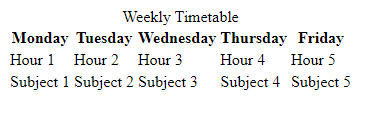

---
# Aufgabe
 

Aufgabe: Styling des timetables
* 100 Punkte
* 45 Minuten (Viel Erfolg!)

---
<ol>
<li> Styling the Timetable with CSS (20 Punkte)</li>
<ul><li> Style the Timetable with CSS.</li></ul>
<ul><li> Add a stylesheet with the name timetable.css</li></ul>
<ul><li> add a link in the html file to the stylesheet</li></ul>
Hilfe: 
<ul><li><a href="https://www.w3schools.com/css/css_howto.asp">Spickzettel</a></li></ul> 

---
<li> Change Background Color to light orange (rgb(191, 149, 120)) (20 Punkte)</li>
Hilfe: 
<ul><li><a href="https://www.w3schools.com/cssref/pr_background-color.php">Spickzettel</a></li></ul> 

---
<li> Adjust Text Color to dark brown (48, 45, 42) (20 Punkte)</li>
Hilfe: 
<ul><li><a href="https://www.w3schools.com/css/css_text.asp">Spickzettel</a></li></ul> 

---
<li> Add a (solid) Border (20 Punkte)</li>
Hilfe: 
<ul><li><a href="https://www.w3schools.com/cssref/pr_border.asp">Spickzettel</a></li></ul> 

---
<li> Center Text Alignment (20 Punkte)</li>
Hilfe: 
<ul><li><a href="https://www.w3schools.com/css/css_align.asp#:~:text=Center%20Align%20Text,This%20text%20is%20centered.">Spickzettel</a></li></ul> 

---
</ol>
